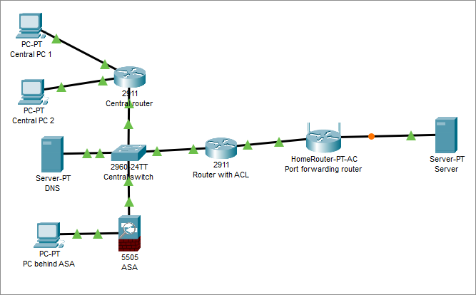

# Лабораторная 1
Изучение access control list и возможностей deep packet inspection сетевого оборудования Cisco.

# Теоретическая часть
## Межсетевые экраны
Межсетевой экран - программный или программно-аппаратный элемент компьютерной сети, осуществляющий контроль и фильтрацию проходящего через него сетевого трафика в соответствии с заданными правилами. Часто отделяет защищенные сегменты сети от незащищенных.

## ACL
ACL (access control list) - список правил межсетевого экрана, запрещающих или разрешающих использование ресурсов сети: доступа к интернету, телефонии, видеосвязи и т.д.

Списки ACL широко используются для обеспечения работы компьютерных сетей и сетевой безопасности с целью предотвращения атак и управления трафиком. Администраторы могут использовать списки ACL для определения классов трафика и управления ими на сетевых устройствах в соответствии с комплексными требованиями по безопасности. Списки ACL можно определять для уровней 2, 3, 4 и 7 OSI.

Список ACL представляет собой последовательный перечень разрешающих или запрещающих правил. Записи можно создавать для выполнения фильтрации трафика на основе определенного критерия, например адреса источника или адреса назначения, протокола и номера порта.

Стандартные списки ACL обрабатывают пакеты, проверяя поле IP-адреса источника. Такие списки ACL используются для фильтрации пакетов только на основании информации об источнике, соответствующей уровню 3. Синтаксис создания стандартных нумерованных ACL:

`access-list {acl-#} {permit | deny} source-addr [source-wildcard] [log]`, где:

* `acl-#` - десятичное число в диапазоне 1..99 или 1300..1999
* `permit` - разрешает доступ
* `deny` - запрещает доступ
* `source-addr` - адрес сети или хоста-источника или слово `any` (любой источник)
* `source-wildcard` - опциональная 32-битная маска источника с единицами в позициях битов, которые игнорируются
* `log` - опционально выводит в журнал сообщение, включающее номер ACL, принятое решение (принять/отклонить), адрес источника

В расширенных ACL списках пакеты проверяются на основе информации уровней 3 и 4 об источнике и адресе назначения. По сравнению со стандартными расширенные списки ACL предоставляют более гибкие возможности по управлению доступом к сети. Синтаксис создания расширенных нумерованных списков ACL:

`access-list {acl-#} {permit | deny} protocol source-addr [source-wildcard] dest-addr [dest-wildcard] [operator port] [established]`, где:

* `acl-#` - десятичное число в диапазоне 100..199 или 2000..2699
* `permit` - разрешает доступ
* `deny` - запрещает доступ
* `protocol` - имя или номер протокола, например: ip, tcp, udp, icmp
* `source-addr` - адрес сети или хоста-источника или `any` (любой источник)
* `source-wildcard` - опциональная 32-битная маска источника с единицами в позициях битов, которые игнорируются
* `dest-addr` - адрес сети или хоста-получателя или `any` (любой получатель)
* `dest-wildcard` - опциональная 32-битная маска получателя с единицами в позициях битов, которые игнорируются
* `operator` - опциональный оператор сравнения, допустимые значения: `lt`, `gt`, `eq`, `neq`, `range`
* `port` - опциональный номер TCP или UDP порта
* `established` - опционально применяет правило только к установленному соединению (только TCP)

Применение ACL к интерфейсу:

`Router(config-if)# ip access-group {acl-#} {in|out}`, где:

* `acl-#` - номер ACL
* `in` - применить к входящему трафику
* `out` - применить к исходящему трафику

Просмотр ACL: `Router# show access-lists`

## Уровни безопасности
Межсетевые экраны Cisco ASA используют так называемые "уровни безопасности", которые обозначают насколько доверие пакетам с одного интерфейса больше доверия пакетам с другого интерфейса, чем выше уровень безопасности, тем более доверенным считается интерфейс. Пакеты с интерфейса с более высоким уровнем безопасности могут маршрутизироваться в интерфейсы с более низким, но не наоборот, если явно не настроен access list, который это позволяет.

## Настройка ASA 5505
Межсетевой экран ASA 5505 построен на базе коммутатора (интерфейсы Ethernet0/0 - Ethernet0/7). По умолчанию опередены два VLAN: Vlan 1 и Vlan 2, один для внутренней сети, другой для внешней. Начальная настройка IP адресов и уровней доступа может быть проведена так:
```text
ciscoasa(config)#interface vlan 2
ciscoasa(config-if)#nameif outside
ciscoasa(config-if)#ip address <IP во внешней сети> <маска внешней сети>
ciscoasa(config-if)#security-level 0
ciscoasa(config-if)#interface vlan 1
ciscoasa(config-if)#nameif inside
ciscoasa(config-if)#security-level 100
ciscoasa(config-if)#dhcpd dns <адрес DNS-сервера>
```

Далее необходимо настроить шлюз по умолчанию:
```text
ciscoasa(config)#route outside 0.0.0.0 0.0.0.0 <адрес шлюза по умолчанию>
```

На этом этапе должны работать исходящие пинги из ASA 5505.

Настройка NAT на ASA 5505:
```text
ciscoasa(config)#object network inside-net
ciscoasa(config-network-object)#subnet <внутренняя сеть> <маска внутренней сети>
ciscoasa(config-network-object)#nat (inside,outside) dynamic interface
ciscoasa(config-network-object)#end
```

## DPI
DPI (deep packet inspection) - технология проверки сетевых пакетов по их содержимому для регулирования и фильтрации трафика. В отличие от простых ACL, блокировку трафика с использованием DPI нельзя обойти сменой порта. DPI используется в корпоративной среде для избежания утечек информации. В быту DPI можно встретить при использовании мобильного интернета: операторы связи часто замедляют трафик, связанный с P2P-сетями, такими как BitTorrent. Также DPI используется для реализации блокировок сайтов.

Создание карты классов на ASA 5505:
```text
ciscoasa(config)#class-map inspection_default
ciscoasa(config-cmap)#match default-inspection-traffic
ciscoasa(config-cmap)#exit
```

Настройка DPI на ASA 5505:
```text
ciscoasa(config)#policy-map global_policy
ciscoasa(config-pmap)#class inspection_default
ciscoasa(config-pmap-c)#inspect <протокол>
ciscoasa(config-pmap-c)#exit
ciscoasa(config)#service-policy global_policy global
```

Будет разрешен трафик протокола _протокол_.

# Задание


Адреса подсетей должны содержать номер группы и порядковый номер студента в группе.

1. Построить сеть
2. Настроить маршрутизацию между `Central PC 1` и `Port forwarding router`
3. Настроить веб-сервер на `Server`
4. На `Port forwarding router` настроить перенаправление портов 80 и 8000 на веб-сервер
5. Настроить DNS сервер: добавить DNS-запись для доступа к веб-серверу
6. Проверить доступ к веб-серверу с `Central PC 1` по доменному имени
7. Настроить расширенный ACL на роутере `Router with ACL` для запрета доступа с `Central PC 1` к веб-серверу на стандартном порте
8. Продемонстрировать доступ к веб-серверу по доменному имени с `Central PC 2`, отсутствие доступа с `Central PC 1` на стандартном порте и наличие на нестандартном
9. Настроить NAT и DPI на ASA 5505, разрешить исходящий ICMP и DNS трафик
10. С `PC behind ASA` продемонстрировать работу ICMP и отсутствие доступа к веб-серверу
11. Разрешить HTTP-трафик в DPI на ASA 5505, продемонстрировать наличие доступа к веб-серверу с `PC behind ASA`
