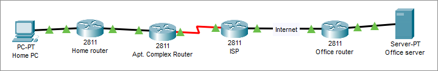

# Лабораторная 2
Изучить протоколы защиты данных в Cisco Packet Tracer на примере PPP и IPsec.

# Теоретическая часть
## Хеширование
Хеш-функция - функция, осуществляющая преобразование массива входных данных произвольной длины в выходную битовую строку установленной длины. Преобразование, производимое хеш-функцией, называется хешированием. Для защиты информации чаще всего используются криптографические хеш-функции, которые отличаются необратимостью и защищенностью от коллизий.

## PPP
PPP (Point-to-Point-Protocol) - протокол второго уровня модели OSI. Обычно используется для установления прямой связи между двумя узлами сети. Обеспечивает аутентификацию соединения, шифрование и сжатие данных.

В сетевом оборудовании от Cisco PPP включается так:
```text
Router(config)#int serial1/0
Router(config-if)#encapsulation ppp
```

Наиболее распространенные алгоритмы аутентификации - PAP и CHAP. PAP (password authentication protocol) считается устаревшим и небезопасным, т.к. отправляет пароли в чистом виде, из-за чего их легко проверять. CHAP (challenge handshake authentication protocol) не передает пароль в открытом виде, вместо этого он использует трехэтапное согласование:

1. Сторона отправляет пакет типа challenge с числом.
2. Другая сторона объединяет число из пакета и свой секрет, вычисляет и отправляет хеш.
3. Хеш принимается первой стороной и сравнивается с ожидаемым значением. Если оно совпадает, то аутентификация пройдена.

Если перехватить challenge пакет и пакет с ответом на него, то можно перебирать пароль по словарю или полным перебором пока хеш не совпадет.

Для настройки CHAP необходимо задать имя хоста на обоих маршрутизаторах и создать пользователей для маршрутизатора на другом конце. Предположим, что настраивается PPP между RouterA и RouterB, тогда настройка RouterA будет выглядеть так:
```text
Router1(config)#hostname RouterA
RouterA(config)#username RouterB secret <пароль>
```
Аналогичную процедуру необходимо провести на RouterB. Имена хостов должны отличаться, а _пароль_ совпадать.

## IPsec
IPsec - набор протоколов для обеспечения защиты данных. Позволяет осуществлять аутентификацию, проверку целостности и шифрование IP-пакетов. IPsec также включает в себя протоколы для защищённого обмена ключами в сети Интернет. В основном применяется для организации VPN-соединений. IPsec реализован на сетевом (3-м) уровне.

Для настройки IPsec сначала необходимо настроить ISAKMP - протокол из набора IPsec для аутентификации и обмена ключами:
```text
Router(config)#crypto isakmp policy 10
Router(config-isakmp)#encryption aes 256
Router(config-isakmp)#authentication pre-share
Router(config-isakmp)#group 5
Router(config-isakmp)#exit
Router(config)#crypto isakmp key <пароль> address <адрес внешнего интерфейса другой стороны туннеля>
```

Далее необходимо задать, что будет использоваться ESP (encapsulating security payload) - протокол, обеспечивающий шифрование данных, проверку целостности, аутентификацию источника, а также защиту от повторной передачи:
```text
Router(config)#crypto ipsec transform-set set1 esp-aes 256 esp-sha-hmac
```

Здесь и на прошлом шаге задаются: алгоритм шифрования (AES-256), эллиптическая кривая (группа 5), алгоритм аутентификации (HMAC на базе хеша SHA).

После этого необходимо создать ACL, разрешающий перенаправление трафика между сетями, между которыми будет развернут туннель:
```text
Router(config)#access-list 100 permit ip <сеть 1> <обратная маска 1> <сеть 2> <обратная маска 2>
```
Например для соединения сетей 192.168.1.0/24 и 192.168.2.0/24 для маршрутизатора в сети 192.168.1.0/24 правило будет выглядеть так:
```text
Router(config)#access-list 100 permit ip 192.168.1.0 0.0.0.255 192.168.2.0 0.0.0.255
```

В конце необходимо создать криптокарту IPsec:
```text
Router(config)#crypto map IPSec 100 ipsec-isakmp
Router(config-crypto-map)#set peer <адрес внешнего интерфейса другой стороны туннеля>
Router(config-crypto-map)#set pfs group5
Router(config-crypto-map)#set security-association lifetime seconds 86400
Router(config-crypto-map)#set transform-set set1
Router(config-crypto-map)#match address 100
```

И включить IPsec на внешнем интерфейсе:
```text
Router(config)#int fa0/0
Router(config-if)#crypto map IPSec
```

# Задание


Адреса подсетей должны содержать номер группы и порядковый номер студента в группе.

1. Построить сеть
2. Настроить PPP с аутентификацией CHAP между Apt. Complex Router и ISP
3. Настроить шлюзы по умолчанию и маршрутизацию всех сетей кроме сети за Home router и сети за Office router
4. Настроить IPsec туннель между Home router и Office router
5. Продемонстрировать доступ к серверу Office server с компьютера Home PC
