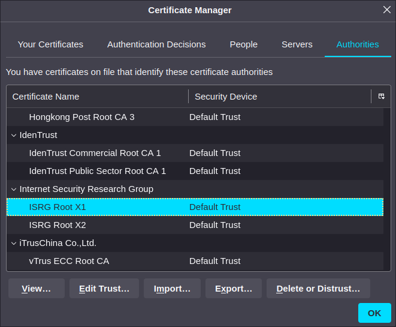
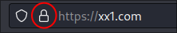
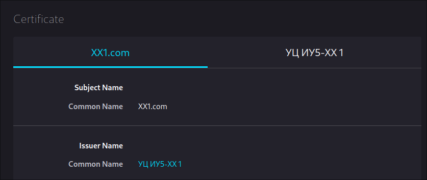
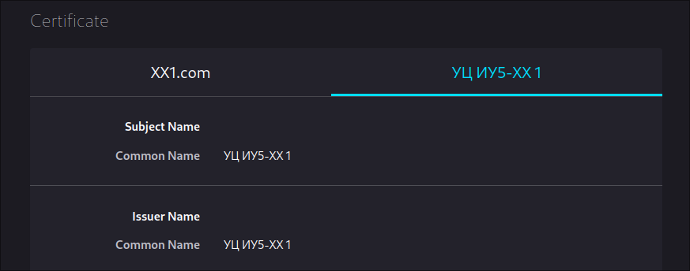
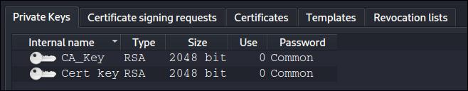
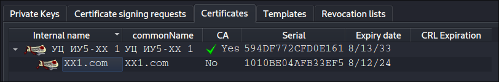

# Лабораторная 3
Изучить инфраструктуру открытых ключей на примере создания сертификата удостоверяющего центра, подписи сертификата, и настройки веб-сервера для использования TLS.

# Теоретическая часть
## Файл hosts
Файл hosts - текстовый файл, содержащий доменные имена и соответствующие им IP адреса. Файл hosts - первый в списке алгоритмов распознавания имен, поэтому если для доменного имени нашелся соответствующий IP адрес, то все остальные алгоритмы использованы не будут, т.е. не будет отправлен DNS запрос, NetBIOS запрос и т.д.

В ОС Windows файл hosts находится по пути `C:\Windows\system32\drivers\etc`, в unix-based системах - `/etc/hosts`.

Строка файла hosts обычно состоит из IP адреса, идущего за ним пробела, и доменного имени. Часто для блокировки подключения к конкретных доменным именам, им в соответствие ставят IP адрес 0.0.0.0.

## Асимметричная криптография
В отличие от симметричной криптографии, в асимметричной используется два ключа: открытый (публичный, public) и закрытый (секретный, "приватный", private). Открытый ключ распространяется свободно, а закрытый держится в секрете и хранится только у владельца. Сообщение, зашифрованное для одного ключа, можно расшифровать только другим, поэтому для шифрования сообщений используют открытый ключ, при этом адресат расшифровывает сообщение соответствующим закрытым ключом, а для подписи - закрытый ключ, чтобы расшифровать (проверить действительность подписи, т.е. личность подписывающего) ее могли все, т.к. соответствующий открытый ключ распространяется свободно.

На практике операция шифрования данных асимметричной криптографией используется чаще всего в фазе установления соединения только для шифрования ключа симметричного шифра, который будет использоваться для шифрования всех остальных данных.

## Инфраструктура открытых ключей
Инфраструктура открытых ключей (PKI - public key infrastructure) - набор средств, служб и компонентов, в совокупности используемых для поддержки криптозадач на основе закрытого и открытого ключей.

Основные Принципы:

* закрытый ключ (private key) известен только его владельцу
* удостоверяющий центр (УЦ или CA - certificate authority) создает сертификат, таким образом удостоверяя факт того, что закрытый ключ известен только владельцу этого сертификата
* никто не доверяет друг другу, но все доверяют удостоверяющему центру
* удостоверяющий центр подтверждает или опровергает принадлежность открытого ключа заданному лицу, которое владеет соответствующим закрытым ключом

## Удостоверяющие центры
Удостоверяющий центр является структурой, формирующей цифровые сертификаты подчиненных центров сертификации и конечных пользователей. УЦ является доверенной третьей стороной.

Сертификат - это данные пользователя/сервера и его открытый ключ, скрепленные электронной подписью удостоверяющего центра. Выпуская сертификат открытого ключа, удостоверяющий центр тем самым подтверждает, что лицо, записанное в сертификате, владеет закрытым ключом, который соответствует этому открытому ключу.

Корневые удостоверяющие центры - центры сертификации, которым доверяют изначально все, либо руководствуясь политикой предприятия, либо из-за предустановленных настроек хранилища сертификатов, и которые могут находиться в начале пути доверия.

## Сертификаты
Простой сертификат содержит следующие поля:

* `Serial Number` - серийный номер, используется для идентификации сертификата в автоматизированных системах УЦ
* `Subject` - кому принадлежит сертификат: конкретной машине, лицу, организации
* `Issuer` - издатель сертификата, тот, кто его подписал
* `Not Before` - дата начала действия сертификата
* `Not After` - дата конца действия сертификата
* `Key Usage` - задачи, для которых действителен публичный ключ сертификата: проверка подписи, подпись других сертификатов (только для УЦ, не разрешена у конечных сертификатов) и т.д.
* `Extended Key Usage` - для каких еще задач может быть использован сертификат: аутентификация сервера, защита почты, подпись программного кода
* `Public Key` - публичный ключ
* `Signature Algorithm` - алгоритм подписи
* `Signature` - подпись: хеш и подпись (алгоритмом из поля `Signature Algorithm`) секретным ключом издателя сертификата

Поле `Subject` часто состоит из:

* `common name` (CN) - доменное имя
* `organization` (O) - организация
* `organizational unit` (OU) - единица внутри организации, например отдел
* `country` (C) - страна (например US)
* `locality` (L) - город (например San Francisco)
* `state` (ST) - штат или область (например California)

Сертификат считается самоподписанным, если его издатель совпадает с самим сертификатом. Подпись в таком случае проверяется публичным ключом самого сертификата. Сертификаты корневых УЦ обычно самоподписанные.

Для получения сертификата у УЦ необходимо сформировать запрос на подпись сертификата (CSR - certificate signing request), который не будет рассматриваться в контексте данной лабораторной работы.

Цепь сертификатов на примере сайта https://www.opennet.ru:
```text
$ openssl s_client -showcerts -connect www.opennet.ru:443
depth=2 C = US, O = Internet Security Research Group, CN = ISRG Root X1
verify return:1
depth=1 C = US, O = Let's Encrypt, CN = R3
verify return:1
depth=0 CN = opennet.ru
verify return:1
---
Certificate chain
 0 s:CN = opennet.ru
   i:C = US, O = Let's Encrypt, CN = R3
   a:PKEY: rsaEncryption, 4096 (bit); sigalg: RSA-SHA256
   v:NotBefore: Jul 10 18:53:16 2023 GMT; NotAfter: Oct  8 18:53:15 2023 GMT
   ...
 1 s:C = US, O = Let's Encrypt, CN = R3
   i:C = US, O = Internet Security Research Group, CN = ISRG Root X1
   a:PKEY: rsaEncryption, 2048 (bit); sigalg: RSA-SHA256
   v:NotBefore: Sep  4 00:00:00 2020 GMT; NotAfter: Sep 15 16:00:00 2025 GMT
   ...
 2 s:C = US, O = Internet Security Research Group, CN = ISRG Root X1
   i:O = Digital Signature Trust Co., CN = DST Root CA X3
   a:PKEY: rsaEncryption, 4096 (bit); sigalg: RSA-SHA256
   v:NotBefore: Jan 20 19:14:03 2021 GMT; NotAfter: Sep 30 18:14:03 2024 GMT
   ...
```

Виден сертификат `CN = opennet.ru`, который принадлежит непосредственно сайту, который издан `C = US, O = Let's Encrypt, CN = R3`, который издан `C = US, O = Internet Security Research Group, CN = ISRG Root X1`.

Последний является сертифкатом корневого УЦ. Найти его можно в системном хранилище сертификатов корневых УЦ, а также в веб-браузерах, которые обычно имеют свои списки, которые обновляются независимо от механизма обновления ОС. `ISRG Root X1` в хранилище сертификатов Firefox:



Сертификат между корневым и принадлежащим конкретно opennet.ru, принадлежит [Let's Encrypt](https://letsencrypt.org/). Let's Encrypt - популярный УЦ, появившийся в 2014 году, предоставляющий бесплатные сертификаты при условии подтверждения владения сервером. Подтверждение может быть целиком автоматизировано и состоит из создания файла с одноразовой строкой на сервере и отдачей его по HTTP.

Сертификат, принадлежащий opennet.ru, не имеет способности подписывать другие сертификаты.

С точки зрения безопасности, атакующий, получивший доступ к сертификату доверенного УЦ, может подписывать любые сертификаты и использовать их, например, для перехвата трафика, если организует атаку типа "человек посередине" (не обязательно активная атака, это может сделать, например, VPN-провайдер). Неоднократно из списка корневых сертификатов удалялись сертификаты УЦ, действия которых были подозрительными (примеры: [TrustCor](https://nvd.nist.gov/vuln/detail/CVE-2022-23491), [Symantec](https://habr.com/ru/articles/334392/)).

Тем не менее, по сей день в списке корневых сертификатов можно встретить например `Hongkong Post Root CA` (виден на скриншоте выше), который, судя по всему, принадлежит почте Гонконга. Срок его действия абсурдно большой - 2017-2042 годы. Стоит ли доверять почте Гонконга так, как это делает по умолчанию Firefox?

# Практическая часть
В практической части будет рассмотрено создание сертификата УЦ, подписи сертификата веб-сервера и настройка веб-сервера nginx. Создание УЦ или использование самоподписанных сертификатов на практике часто используется в интранетах различных компаний.

## Инструменты
[Kali Linux](https://www.kali.org/) - дистрибутив GNU/Linux для проведения тестов безопасности. Основан на основе Debian, имеет множество предустановленных инструментов.

[XCA](https://hohnstaedt.de/xca/) - программа для управления ключами и сертификатами.

[nginx](https://nginx.org/ru/) - веб-сервер.

[Firefox](https://www.mozilla.org/en-US/firefox/) - веб-браузер.

## Создание и запуск виртуальной машины
1. Тип: Linux, Debian (64-bit)
2. Оперативная память: 2560 МиБ, процессор: 2+
3. Жесткий диск: отсутствует
4. CD диски: `kali-linux-2023.1-live-amd64.iso` и `kalipackages.iso`

После создания ВМ:

1. Запустить ВМ
2. Выбрать "Live system (amd64)" в загрузчике
3. Дождаться загрузки
4. Открыть терминал: ПКМ по рабочему столу > Open Terminal Here
5. Если рабочий стол виртуальной машины слишком маленький относительно размера окна в хост-системе, то попробовать изменить размер окна ВМ. Если не помогло, то ПКМ по рабочему столу > Open Terminal Here, ввести `xrandr --output Virtual1 --mode 1920x1080`, где 1920x1080 - одно из поддерживаемых разрешений. Полный список можно посмотреть выполнив `xrandr` без агрументов.
6. Открыть диск `Packages` (значок есть на рабочем столе), открыть терминал в открывшейся директории, выполнить `sudo dpkg -i xca*.deb`

## Создание БД в XCA
XCA хранит все данные в базе данных. Для создания базы данных необходимо выбрать File > New DataBase, после чего ввести название и нажать Save. После этого программа предложит ввести пароль, при этом разрешается использовать пустые пароли.

## Создание приватных ключей в XCA
1. Выбрать вкладку `Private Keys`
2. Нажать `New Key`
3. Ввести название ключа, выбрать тип и длину
4. Нажать `Create`

## Генерация сертификата
1. Выбрать вкладку `Certificates`
2. Нажать `New Certificate`
3. Выбрать шаблон (`Template for new certificate`). В контексте лабораторной работы либо `[default] CA` для удостоверяющего центра, либо `[default] TLS_server` для веб-сервера. Нажать `Apply all`.
4. Выбрать издателя сертификата: либо другой сертификат, либо самоподписанный (`Create a self signed certificate`)
5. Заполнить поля во вкладке `Subject`. Поля `commonName` в контексте лабораторной работы будет достаточно.
6. Выбрать правильный приватный ключ (`Private key`)
7. Нажать `OK`

Если сертификат был издан УЦ, то он будет скрыт в раскрывающемся списоке соответствующего сертификата УЦ.

## Экспорт сертификатов из XCA
1. Выбрать необходимый сертификат
2. Нажать кнопку `Export` (справа)
3. Ввести название файла
4. Выбрать формат. В контексте лабораторной работы: если необходима полная цепочка, то необходимо выбрать `PEM chain (*.pem)`, иначе `PEM (*.crt)`.
5. Нажать `OK`

## Экспорт ключей из XCA
1. Выбрать необходимый ключ
2. Нажать кнопку `Export` (справа)
3. Ввести название файла
4. Выбрать формат. В контексте лабораторной работы `PEM private (*.pem)`.
5. Нажать `OK`

## Настройка TLS в nginx
1. Открыть терминал: нажать на значок в верхнем левом углу (рядом с цифрой 1)
2. Открыть `/etc/nginx/nginx.conf` в любом текстовом редакторе (предустановлены `vim` и `nano`) с правами `root`.

    В случае nano: `sudo nano /etc/nginx/nginx.conf`. Перемещение стрелками, Ctrl-S - сохранить, Ctrl-X - выйти.
3. В блок `http` (начинается со строки `http {`) добавить:

    ```text
    server {
      listen 443 ssl;
      ssl_certificate /home/kali/XXYY.com.pem;
      ssl_certificate_key /etc/nginx/Cert_key.pem;
    }
    ```
    Где `XXYY.com.pem` - имя файла экспортированного сертификата, `Cert_key.pem` - имя файла приватного ключа.
4. Сохранить, выйти из текстового редактора, выполнить `sudo systemctl restart nginx`.

## Добавление записи в файл hosts
Аналогично прошлому пункту открыть файл `/etc/hosts` в текстовом редакторе, добавить строку:
```text
127.0.0.1 XXYY.com
```
Сохранить и выйти из редактора.

Это необходимо делать так как при подключении по HTTPS будет проверяться соответствие сертификата доменному имени, поэтому при подключении к https://127.0.0.1/ будет выведена ошибка, а при подключении к https://XXYY.com/ - нет.

## Добавление УЦ в Firefox
Нажать Alt на клавиатуре > Edit > Settings > Privacy & Security > View Certificates > Authorities > Import > `УЦ_ИУ5-XX_YY.crt` (название файла сертификата УЦ), поставить галочку "Trust this CA to identify websites", нажать OK.

## Информация о сертификатах в Firefox
На примере имени `xx1.com`.

Нажать на значок с изображением замка: \
 \
Далее `Connection secure` > `More information` > `View Certificate`.

Начало информации о сертификате веб-сервера будет выглядеть примерно так: \
 \
А информация об УЦ так: \


# Задание
Далее XXYY - число, где XX - номер группы, YY - порядковый номер студента в группе.

1. Запустить ВМ
2. Запустить XCA, создать базу данных
3. Создать два приватных ключа: один для удостоверяющего центра, другой для сертификата веб-сервера
  
4. Создать самоподписанный сертификат УЦ. В `commonName` включить номер группы и порядковый номер студента в группе.
5. Создать сертификат для веб-сервера, изданный УЦ. `commonName` в формате `XXYY.com`
  
6. Экспортировать полную цепочку сертификата веб-сервера, приватный ключ сертификата веб-сервера, и сертификат УЦ
7. Настроить TLS в веб-сервере nginx
8. Добавить запись для распознавания доменного имени `XXYY.com` в файл hosts
9. Добавить УЦ в Firefox
10. Открыть https://XXYY.com/ в Firefox (значок слева от значка терминала), продемонстрировать демо-страницу, информацию о сертификате веб-сервера и УЦ
